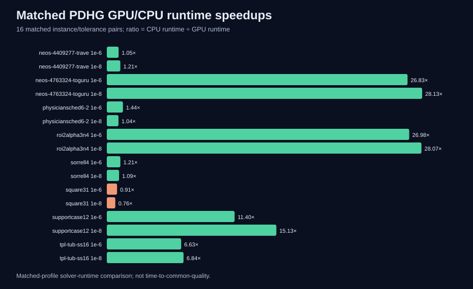

# GPU/CPU LP benchmarks with Gurobi PDHG

[](https://github.com/adamlpolansky/pdhg-gpu-lp-benchmarks/actions/workflows/ci.yml)

How do dual simplex, barrier, and CPU/GPU PDHG behave as several linear-programming families scale? This repository is a small, clean-history, recruiter-facing snapshot of my MSc thesis research at Charles University: deterministic demo generators, validation code, sanitized aggregate evidence, and reproducible figures.

## Curated MSc thesis benchmark snapshot

The study contains five controlled LP families—cutting stock (CS), capacitated multicommodity flow (MCF), random bounded equality (RBE), long-only CVaR portfolio, and robust production–inventory (ROB)—plus one external validation block of eight public MIPLIB 2017 LP relaxations. Gurobi's PDHG implementation is selected with `Method=6`; I did not implement the Gurobi solver or a custom CUDA kernel.

| Result | Recomputed value | Denominator |
|---|---:|---:|
| External full audit | 60 `OPTIMAL`, 4 `SUBOPTIMAL` | 64 terminal slots |
| Certified primary subset | 48 `OPTIMAL` | 48 slots |
| Matched GPU/CPU PDHG pairs | GPU faster in 14 | 16 pairs |
| Median matched-profile speedup | 4.0366× | 16 pairs |
| Stable matched subset | GPU faster in 6 | 8 pairs with both runtimes ≥ 1 s |
| Fastest method by instance | dual 2, barrier 2, GPU-PDHG-1e-6 4 | 8 instances |



Caption: CPU runtime divided by GPU runtime for all 16 matched instance/tolerance pairs in the certified external panel. This is a matched-profile solver-runtime comparison, not time-to-common-quality, and it is not a claim of universal GPU dominance.

## Credential-free quickstart

The quickstart needs neither a Gurobi licence nor a GPU. Demo configs are JSON-compatible YAML and use only the Python standard library.

```bash
python -m venv .venv
python -m pip install --upgrade pip
python -m pip install -e ".[dev]"
python -m pytest -q
python -m ruff check .
python -m pdhg_benchmarks.demo --config configs/demo/cs_tiny.yaml
python -m pdhg_benchmarks.evidence --check
python scripts/check_publication.py
```

## What I built

- deterministic, solver-independent tiny generators and explicit feasibility-witness validation for all five controlled families;
- a strict public evidence schema that separates planned slots, attempted solves, terminal records, solver status, time limits, resource skips, execution failures, numerical failures, and quality results;
- deterministic SVG rendering and SHA-256 verification from sanitized public CSV files;
- an adversarial publication scanner with allowlist, metadata, symlink, size, and evidence checks;
- portable CI on Ubuntu and Windows.

The benchmark methods were dual simplex, barrier without crossover, and Gurobi PDHG on CPU or GPU at requested tolerance profiles `1e-4`, `1e-6`, and `1e-8`. See [methodology](docs/methodology.md), [results](docs/results.md), [reproducibility](docs/reproducibility.md), and the [data dictionary](docs/data_dictionary.md).

## Important limitations

GPU PDHG was not always fastest, and these results do not prove general solver dominance. A terminal record is not necessarily `OPTIMAL`; a time limit is not a crash; a quality-gate failure is not a solver failure. The public CI validates demos and the frozen aggregate snapshot but does not reproduce the licensed full GPU campaign. The external primary exclusion of `1e-4` is a transparent post-run analytical revision, not the original preregistered rule. The `ready_to_share` field concerns aggregate analysis only, not Git-history safety.

The optional `gurobi` extra pins the tested Python API version for users who already have their own authorized installation and licence; this repository deliberately contains no benchmark runner, solver logs, model instances, or credentials.

## License

Original code and documentation by Adam Luboš Polanský are released under the [MIT License](LICENSE), subject to the exclusions and attribution in [third-party notices](THIRD_PARTY_NOTICES.md). The MIT License does not cover Gurobi software or undistributed MIPLIB model files.
