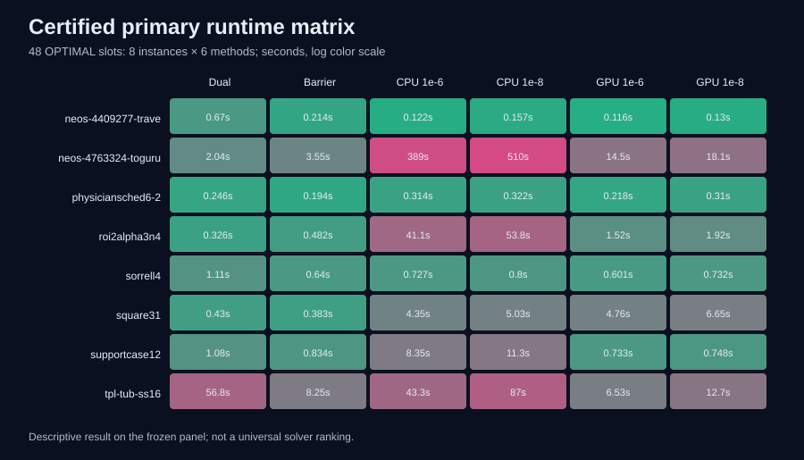
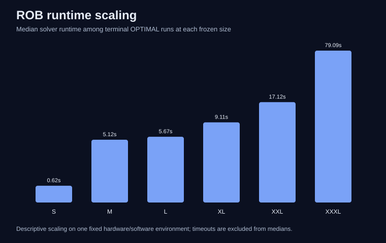

# Results

## Controlled families

| Family | Planned | Attempted | `OPTIMAL` | Time limits | Resource skips | GPU confirmed | Strict common-gate passes |
|---|---:|---:|---:|---:|---:|---:|---:|
| CS | 48 | 48 | 48 | 0 | 0 | 18 | 12 |
| MCF | 48 | 40 | 36 | 4 | 8 | 15 | 9 |
| RBE | 48 | 48 | 43 | 5 | 0 | 18 | 17 |
| CVaR | 48 | 48 | 46 | 2 | 0 | 18 | 26 |
| ROB | 48 | 48 | 46 | 2 | 0 | 18 | 9 |

ROB also has one explicitly separate diagnostic solve. The table does not count that diagnostic in the 48-slot matrix. MCF's eight XXXL slots are terminal pre-attempt resource classifications; they are not solve calls. All controlled negative and censored outcomes remain in the family CSV files.

## External validation

The full external audit has 64 terminal slots: 60 `OPTIMAL` and four `SUBOPTIMAL`, with no time limits or resource skips. The normalized terminal interpretation contains 60 completed rows, three numerical failures, and one execution failure. `SUBOPTIMAL` here records the solver status and is not silently rewritten as a crash.

The certified primary subset contains 48/48 `OPTIMAL` rows. Across 16 matched PDHG CPU/GPU pairs, GPU is faster in 14 and the median CPU/GPU runtime ratio is 4.03663976563391×. The stable subset—both matched runtimes at least one second—contains eight pairs, with GPU faster in six. Across the eight instances, the fastest certified method is dual simplex twice, barrier twice, and GPU PDHG at `1e-6` four times.

Caption: solver runtime in seconds for all 48 certified rows, shown on a logarithmic color scale. Every method and instance is included. This is a descriptive matrix, not a universal solver ranking.

Caption: median runtime among `OPTIMAL` ROB rows at each frozen size. Time limits are excluded from the median but remain present in `evidence/rob_results.csv`. The scaling relationship is descriptive for this environment.
